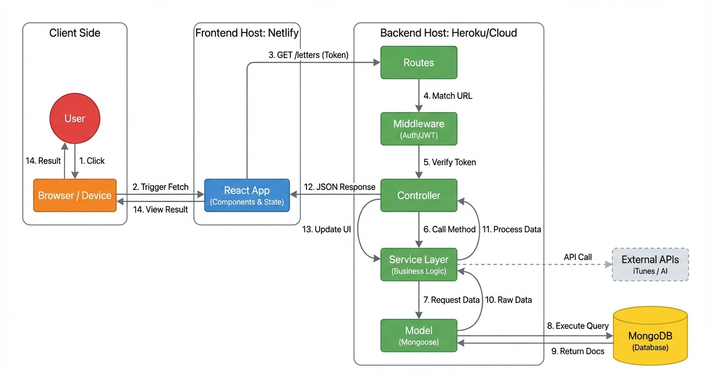

# SoulMail: Whispers to Myself

Write letters to your future self. Capture your thoughts, feelings, and goals today, then receive them at a future date you choose. Reflect on your journey and celebrate your growth.

**[Try the Live App](https://endearing-bombolone-fd75f5.netlify.app/)**

## Table of Contents

- [About the Project](#about-the-project)
- [Features](#features)
- [Technologies Used](#technologies-used)
- [Getting Started](#getting-started)
  - [What You Will Need](#what-you-will-need)
  - [Setting Up the Backend](#setting-up-the-backend)
  - [Setting Up the Frontend](#setting-up-the-frontend)
- [Project Structure](#project-structure)
- [Architecture](#architecture)
- [How It Works](#how-it-works)
- [Future Improvements](#future-improvements)
- [Team](#team)

## About the Project

SoulMail is a personal journaling application that helps you connect with your future self. Write letters capturing your current emotional state, your goals, and meaningful moments from your day. Choose when you want to receive your letter - whether that is a week, a month, or even five years from now.

When your letter arrives, you can reflect on how much you have changed, track your progress on goals, and celebrate your personal growth.

## Features

**Letter Writing**
- Write detailed letters to your future self
- Track your mood, weather, location, and temperature
- Add the top news headline of the day
- Set up to three personal goals
- Attach a song that represents your current moment
- Create drawings or doodles to include with your letter

**Delivery Options**
- Schedule delivery in one week, one month, six months, one year, or five years
- Set a custom delivery date (minimum one week from today)

**Reflection**
- Add reflections when your letters arrive
- Track progress on your goals (completed, in progress, not started)
- Carry forward unfinished goals to new letters
- Add drawings to delivered letters

**AI-Powered Features**
- Get personalized writing prompts to help you get started
- Receive daily affirmations
- Get reflection prompts tailored to your delivered letters

**Celebrations**
- Confetti animations when your letters are delivered
- Customizable celebration preferences

## Technologies Used

**Frontend**
- React 19 - Building the user interface
- React Router 7 - Navigation between pages
- Vite - Development server and build tool
- CSS - Styling

**Backend**
- Node.js - Server runtime
- Express 5 - Web framework
- MongoDB - Database for storing user data and letters
- Mongoose - Database modeling
- JWT - User authentication
- bcrypt - Password security
- Google Gemini AI - AI-powered features (affirmations, prompts)

**External Services**
- iTunes Search API - Song search and preview functionality

**Deployment**
- Netlify - Frontend hosting
- Heroku - Backend hosting (or your preferred platform)

## Getting Started

Follow these steps to run SoulMail on your computer.

### What You Will Need

Before starting, make sure you have these installed:
- Node.js (version 18 or higher) - Download from [nodejs.org](https://nodejs.org)
- A MongoDB database - You can create a free one at [MongoDB Atlas](https://www.mongodb.com/atlas)
- A Google Gemini API key - Get one at [Google AI Studio](https://ai.google.dev)

### Setting Up the Backend

1. Open your terminal and navigate to the backend folder:
   ```bash
   cd backend
   ```

2. Install the required packages:
   ```bash
   npm install
   ```

3. Create a file called `.env` in the backend folder with these settings:
   ```
   MONGODB_URI=your_mongodb_connection_string
   JWT_SECRET=your_secret_key_here
   GEMINI_API_KEY=your_gemini_api_key
   PORT=3000
   FRONTEND_URL=http://localhost:5173
   ```

   Replace the placeholder values with your actual credentials:
   - `MONGODB_URI`: Your MongoDB connection string from MongoDB Atlas
   - `JWT_SECRET`: Any long, random string for security (example: a 64-character random string)
   - `GEMINI_API_KEY`: Your Google Gemini API key

4. (Optional) Add sample data to the database:
   ```bash
   npm run seed
   ```

5. Start the backend server:
   ```bash
   npm run dev
   ```

   The server will run at `http://localhost:3000`.

### Setting Up the Frontend

1. Open a new terminal window and navigate to the frontend folder:
   ```bash
   cd frontend
   ```

2. Install the required packages:
   ```bash
   npm install
   ```

3. Create a file called `.env` in the frontend folder:
   ```
   VITE_BACK_END_SERVER_URL=http://localhost:3000
   ```

4. Start the frontend:
   ```bash
   npm run dev
   ```

5. Open your browser and go to `http://localhost:5173`.

## Project Structure

```
project/
├── frontend/                 # User interface
│   ├── src/
│   │   ├── components/       # React components (pages and features)
│   │   ├── services/         # API communication
│   │   ├── contexts/         # Shared application state
│   │   └── utils/            # Helper functions
│   └── public/               # Images and static files
│
└── backend/                  # Server and database
    ├── server.js             # The main entry point - starts everything
    ├── routes/               # Decides which code handles each web address
    ├── controllers/          # Receives requests and sends responses
    ├── services/             # Does the actual work (business logic)
    ├── models/               # Defines how data looks in the database
    ├── middleware/           # Checks that run before requests (like security)
    └── utils/                # Helper functions used in multiple places
```

### How the Backend is Organized

The backend follows a simple pattern where each piece has one job. Think of it like a restaurant: the host greets you (routes), the waiter takes your order (controllers), and the kitchen prepares your food (services).

#### How a Request Flows Through the Code

When someone uses the app, here is what happens step by step:

**Example: Getting all letters for a user**

1. **Route** (`routes/letters.js`) - The request arrives and gets directed to the right place:
   ```javascript
   // When someone visits GET /letters, run the getAllLetters function
   router.get('/', verifyToken, letterController.getAllLetters);
   ```

2. **Controller** (`controllers/letters.js`) - Receives the request and asks the service to do the work:
   ```javascript
   const getAllLetters = async (req, res) => {
     const userId = req.user._id;
     const letters = await letterService.getAllLetters(userId);
     // Send the letters back to the user
   };
   ```

3. **Service** (`services/letterService.js`) - Does the actual work of finding the letters:
   ```javascript
   const getAllLettersForUser = async (userId) => {
     // Find all letters belonging to this user
     const letters = await findLettersByUserId(userId);
     return letters;
   };
   ```

4. **Model** (`models/letter.js`) - Defines what a letter looks like in the database:
   ```javascript
   const goalSchema = new mongoose.Schema({
     text: { type: String, required: true },
     status: { type: String, default: 'pending' }
   });
   ```

#### What Each Backend Folder Does

| Folder | Purpose |
|--------|---------|
| **routes/** | Maps web addresses to code (`/letters`, `/auth/sign-up`, `/ai/affirmation`) |
| **controllers/** | Handles communication - receives requests, calls services, sends responses |
| **services/** | Contains the business logic - creating letters, checking passwords, generating AI content |
| **models/** | Defines data structure - what information we store about users and letters |
| **middleware/** | Code that runs before requests - checking if users are logged in, handling errors |
| **utils/** | Helper functions - calculating delivery dates, formatting data |

## Architecture

The diagram below shows how data flows through the application when a user makes a request.



### Request Flow Step by Step

This example shows what happens when a user views their letters:

| Step | What Happens |
|------|--------------|
| 1 | User clicks "My Letters" in the app |
| 2 | Browser triggers a fetch request to the React app |
| 3 | React sends an HTTP request to the backend (`GET /letters`) with the user's authentication token |
| 4 | The Express server matches the URL to the correct route |
| 5 | Middleware checks that the user's token is valid |
| 6 | Controller receives the request and calls the service layer |
| 7 | Service layer contains the business logic and requests data from the model |
| 8 | Model (Mongoose) executes a query to MongoDB |
| 9 | MongoDB returns the matching documents |
| 10 | Raw data flows back to the service layer |
| 11 | Service processes the data and returns it to the controller |
| 12 | Controller sends a JSON response back to the React app |
| 13 | React updates the user interface with the new data |
| 14 | User sees their letters on screen |

The dashed line to External APIs shows that some requests (like getting AI prompts or searching for songs) also communicate with third-party services.

## How It Works

1. **Create an Account**: Sign up with a username and password.

2. **Write a Letter**: Fill in your letter with your thoughts, current mood, goals, and optionally a song or drawing.

3. **Schedule Delivery**: Choose when you want to receive your letter.

4. **Wait**: Your letter stays sealed until the delivery date.

5. **Receive and Reflect**: When the date arrives, your letter is unlocked. Read your past self's words and add your reflections.

6. **Track Goals**: Update the status of any goals you set and carry forward the ones you want to continue working on.

## Future Improvements

Here are features we would like to add in future versions:

**Enhanced User Experience**
- Email or push notifications when letters are delivered
- Dark mode support
- Ability to attach photos to letters
- Voice recording option for letters

**Social Features**
- Write letters to friends or family members (with their consent)
- Share reflections or letter excerpts on social media
- Community prompts and challenges

**Goal Tracking**
- Detailed goal progress visualization
- Goal categories and tagging
- Statistics dashboard showing goal completion rates over time

**Content and Personalization**
- More AI prompt categories (gratitude, mindfulness, career, relationships)
- Seasonal and holiday-themed prompts
- Custom letter templates
- Font and paper style customization

**Technical Improvements**
- Offline support for writing letters without internet
- Letter export to PDF
- Data backup and restore functionality
- Two-factor authentication for added security

## Team

This project was created as a group project for General Assembly's Software Engineering Bootcamp.

---

Questions or feedback? Feel free to open an issue on this repository.
